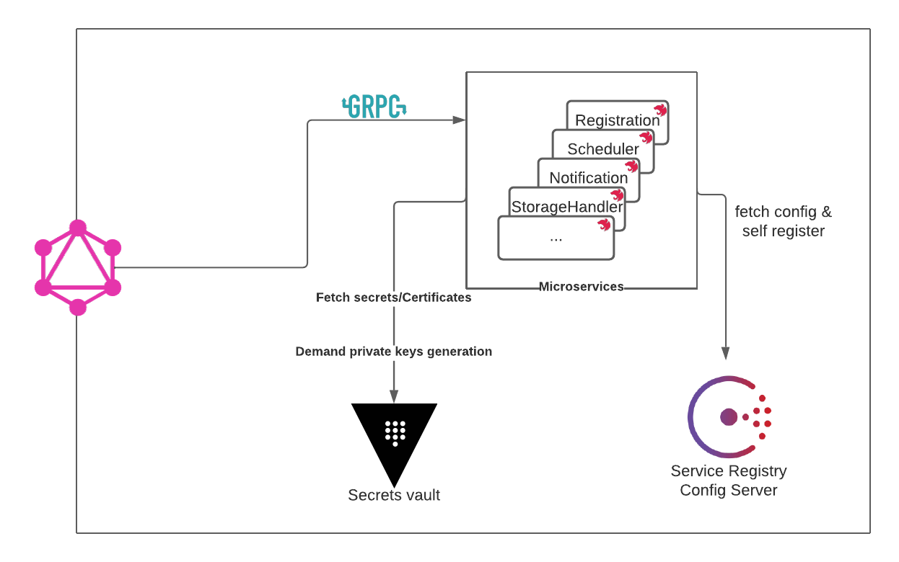
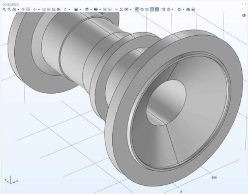

# PLMore

PLMore is an open-source Product Lifecycle Management Software. It offers an alternative to the heavily priced archahic Windchill/Teamcenter solutions. Built with modern tools, It offers a new generation of PLM software that inherently complies with the industry latest technologies, mindsets and runs natively on the cloud.

## Technologies

  
  
   
   
   
   
   
   

## Architecture

## Feature Roadmap
#### 1. Bill of Materials (BOM)
 Having a common source of information across your company is incredibly important during product development. At the very least, our system should provide a single definition of a particular product and its components. More advanced options include features specifically designed for different team members such as designers, engineers and other professionals who frequently collaborate. Excellent systems provide even more comprehensive BOM management. Some solutions extend a centralized BOM that allows users to access multi-level product structures in one place. There’s also drill-down functionality so users can view all levels of assembly and components. Also, health checking and risk assessment tools access online data about the parts you use throughout the product lifecycle. Further, users can see component availability and download compliance documents. Lastly, you can receive notifications anytime a BOM is edited.

- [x] BOM Management
- [x] drill-Down
- [x] Function-Specific BOM
- [x] Advanced Display Options
- [x] Health Checking and Risk Assessment
- [x] Alerts

#### 2. Computer-Aided Design (CAD) Tools and Management
This accessory helps product designers and engineers map out and construct 2D and 3D models of commodities on a computer instead of doing it all on paper.

- [x] Change Management
- [x] Variant Configuration
- [x] Context-Specific BOM Views
- [x] Document Repository
- [x] Mobile Documentation
- [x] Customer Needs Management Documentation
- [x] Process Documentation
- [x] Product Lifecycle Analysis Documentation
- [x] Engineering Collaboration Documentation
- [x] CAD File Management
- [x] CAD Application Integration

#### 3. Product Data Management (PDM)
Storing, arranging and analyzing finished product data can be cumbersome without the right tools. Thanks to a product data management (PDM) module, you can chronicle product designs, necessities and procedures in one central area. Internal and external stakeholders, designers and other team members throughout your company can also upload and share product notes to encourage collaboration. You may also review BOM data, computer-aided design (CAD) documents, supplier information, material data and product lifecycles with a PDM accessory.

- [x] Data Sharing
- [x] CAD files
- [x] BOM Data
- [x] Product Lifecycle Data
- [x] Supplier Information
- [x] Material Data

#### 4. Product Regulation and Governance
Failing to follow regulation and compliance standards is one of the quickest ways to earn your business a bad reputation. But having the right tools built into your PLM system can make staying compliant much more comfortable than it would be otherwise.

      
 Examples of Regulations that will be integrated in the long run 

       

      - [ ] Regulatory Compliance

      - [ ] Medical Device Standards

      - [ ] Environmental Standards

      - [ ] Product Safety Standards

      - [ ] FDA Regulations

      - [ ] ISO Standards

      - [ ] REACH

      - [ ] RoHS

      - [ ] WEEE

      - [ ] JEDEC

      - [ ] China RoHS

      - [ ] Japanese Green Initiative

      - [ ] Conflict Mineral Tracking

      - [ ] DoD

      - [ ] SEC Guidelines

      - [ ] SOP

      - [ ] Vendor-Specific Objective Evidence (VSOE)

      - [ ] Sarbanes-Oxley Act

      - [ ] AICPA

      - [ ] FASB

      - [ ] SEC

#### 5. Project and Component Maintenance
Project management tools are vital for providing users visibility into daily processes and progress. These features include tracking and scheduling capabilities, enabling you to manage product development and resource allocation in real time. Users can also see upcoming milestones and constraints for further planning. Additionally, you can opt for a system that manages your components. Many vendors make insights into component and production data readily available to users. Moreover, stakeholders can receive notifications anytime an edit has been made to CAD assembly regarding components. Users can also access information on manufacturer and supplier equivalent parts. This accessory helps users source the most well-suited components according to compliance, availability, and risk.

- [x] Project Management

- [x] Component Management

#### 6. Quote Process Management

You need data from many different sources during the quote process. PLM’s inherent coordination capabilities gather and organize data for product design to support your engineering teams. This appliance includes teams developing engineer-to-order and configure-to-order products. The system only shares the necessary data, meaning your team members can spend more time focusing on their work and less on hunting down information. A quote process management module also helps streamline your teams’ collaborative efforts.
Additionally, quote process management includes tools to help users determine the cost of a schedule. Users can employ the system to gather PLM requirements and seek out the most competitive quotes.

- [x] Collaborative Tools
- [x] Cost of Schedule
- [x] Automatic Work Order Creation
- [x] Requirements Gathering
- [x] Configure-to-Order
- [x] Engineer-to-Order

#### 7. Risk Management

This feature brings risks to users’ attention, allowing them to manage, report and mitigate those instabilities. Reducing risks early on prevents issues from growing as they move through product development unseen, reducing the overall development cost. Some systems do this by “detecting” or “highlighting” risks, whereas some systems simply offer complete visibility through PM tools.

- [x] Real-Time Project Visibility
- [x] Risk Analysis
- [x] Corrective and Preventive Action (CAPA)

#### 8. User Access Levels

ou don’t want another company benefiting from your team’s hard work, especially when it’s easily avoidable. Many systems control user access to sensitive information by prompting users with security requirements before entering the system. Additionally, once a user has gained access to the system, they can only see as much data as you let them. Provide access based on a specific role or a group hierarchy.

- [x] Role and Group Hierarchy
- [x] Role-Based Access
- [x] Administrative Controls

#### 9. Workflow and Change Management
this suite of tools gives users insight into product activities. Users can determine phases for a project, as well as assign milestones to keep projects on track. Some systems allow users to see all pending and implemented changes, and all items that endure the subsequent effects. This visibility also extends to portfolio and resource management.

- [x] Process Management
- [x] Change Management
- [x] Portfolio Management
- [x] Resource Management

#### 10. Collaboration and Reporting
provide users with robust analytics tools that track the entire lifecycle of a product.

- [x] Reporting
- [x] Gantt Charts
- [x] Dashboards
- [x] Daily Updates
- [x] Analytics

#### 11. Deployment
This will be one of the biggest advantages compared to other available PLMs. The software will be accompanied with a guideline to deploy on kubernetes. Wether it's on your on-premise server or in the cloud.
